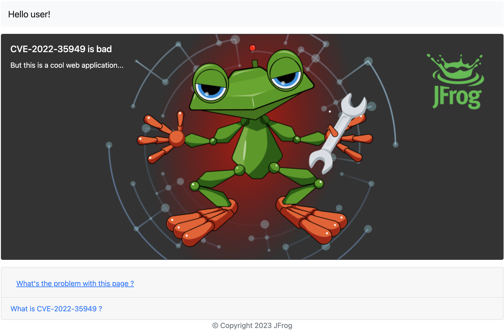

# VulnExpress 

## Overview
This a demo Express JS application to illustrate how a critical vulnerability can be exploited and how it could have been detected and remediated using [Jfrog Advanced Security](https://jfrog.com/advanced-security/) new features.

   

## Build the project and the docker image

Build the project

`npm install`

Run it locally

`npm start`

Build the docker image

`docker build . -t vuln-ejs:latest`

Run it

`docker run -p 3000:3000 vuln-ejs:latest`

## Usage

When clicking on the link on the page an external url is passed to the server, causing a potential SSRF vulnerability.

This link may cause the execution of a remote script on a server, exploiting the SSRF vulnerability found in the UNDICI library CVE-2022-35949
